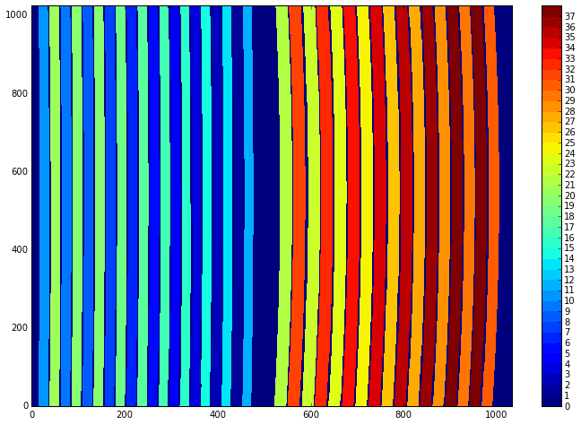
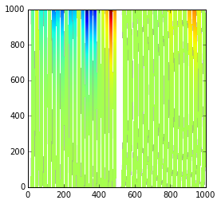
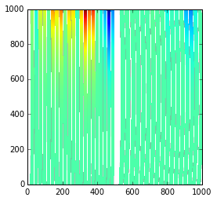
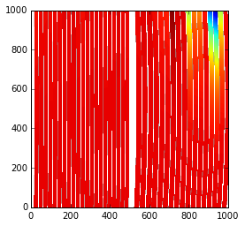

.. code:: python

    from __future__ import division, print_function
    import numpy as np
    from astropy.modeling import models
    from astropy import coordinates as coord
    %matplotlib inline
    from matplotlib import pyplot as plt
    plt.rcParams['image.origin'] = 'lower'
    x, y = np.mgrid[:1000, :1000]
    import tools

.. code:: python

    from gwcs import wcs
    

.. code:: python

    transform = tools.read_model('foc2sky.asdf')
    # In its simplest form
    (reload(wcs))
    gw = wcs.WCS(output_frame='icrs', forward_transform=transform)
    print(gw)
    

.. parsed-literal::

      From   Transform
    -------- ---------
    detector   foc2sky
        icrs      None
    

.. code:: python

    ra, dec = gw(1, 2)
    print(ra, dec)
    

.. parsed-literal::

    5.6305262191 -72.0545768649
    

.. code:: python

    gw.invert(ra, dec)

.. parsed-literal::

    (1.0001954633661871, 2.000000000806444)

.. code:: python

    from gwcs import coordinate_frames as cf
    detector = cf.DetectorFrame()
    focal = cf.FocalPlaneFrame()
    sky = cf.CelestialFrame(reference_frame=coord.ICRS())
    
    distortion = tools.read_model('dist.asdf')
    focal2sky = tools.read_model('foc2sky.asdf')
    
    pipeline = [(detector, distortion),
                (focal, focal2sky),
                (sky, None)]
    
    imwcs = wcs.WCS(output_frame=sky, forward_transform=pipeline)
    print(imwcs)

.. parsed-literal::

        From    Transform 
    ----------- ----------
       detector distortion
    focal_plane    foc2sky
           icrs       None
    

.. code:: python

    
    imwcs.available_frames

.. parsed-literal::

    {'detector': <DetectorFrame(axes_order=(0, 1), axes_names=['x', 'y'],
     'focal_plane': <FocalPlaneFrame(axes_order=(0, 1), axes_names=['x', 'y'],
     'icrs': <CelestialFrame(<ICRS Frame>, axes_order=(0, 1), unit=[Unit("deg"), Unit("deg")])>}

.. code:: python

    ra, dec = imwcs(1, 2)
    print(ra, dec)
    sky = imwcs.output_frame.world_coordinates(ra, dec)
    print(sky)
    print(sky.galactic)
        

.. parsed-literal::

    5.63030044041 -72.0544788707
    <SkyCoord (ICRS): (ra, dec) in deg
        (5.63030044, -72.05447887)>
    <SkyCoord (Galactic): (l, b) in deg
        (306.06953967, -44.89719105)>
    

.. code:: python

    distortion = imwcs.get_transform(detector, focal)
    print(distortion(1, 2))
    

.. parsed-literal::

    (-0.5343708149195018, -6.35901904497471)
    

.. code:: python

    
    shift = models.Shift(0.01) & models.Shift(0.02)
    
    imwcs.insert_transform(frame='focal_plane', transform=shift, after=False)

.. code:: python

    imwcs.get_transform(detector, focal)(1,2)
    

.. parsed-literal::

    (-0.5243708149195018, -6.339019044974711)

Selector example
~~~~~~~~~~~~~~~~

.. code:: python

    from gwcs import selector
    miri_mask = tools.miri_mask()
    tools.show(miri_mask.mask, 38)

.. code:: python

    #help(selector.RegionsSelector)

.. code:: python

    miri_models = tools.miri_models()
    miri_selector = selector.RegionsSelector(inputs=('x', 'y'), outputs=('ra', 'dec', 'lam'), selector=miri_models, selector_mask=miri_mask)

.. code:: python

    from gwcs import spectral_builtin_frames
    sky = cf.CelestialFrame(coord.ICRS())
    spec = cf.SpectralFrame(spectral_builtin_frames.Wavelength())
    oframe = cf.CompositeFrame([sky, spec])
    
    ifuwcs = wcs.WCS(output_frame=oframe, forward_transform=miri_selector)
    
    ra, dec, lam = ifuwcs(x, y)
    

.. code:: python

    #ifuwcs.output_frame.world_coordinates(ra, dec, lam)
    

.. code:: python

    plt.imshow(ra)

.. parsed-literal::

    <matplotlib.image.AxesImage at 0x2e005c18>

.. code:: python

    plt.imshow(dec)

.. parsed-literal::

    <matplotlib.image.AxesImage at 0x2e14c748>

.. code:: python

    plt.imshow(lam)

.. parsed-literal::

    <matplotlib.image.AxesImage at 0x2ec1a390>

.. code:: python

    slice_22_transform = ifuwcs.forward_transform.set_input(22)
    print(slice_22_transform(1, 2))

.. parsed-literal::

    (-8.459308937851162, -2.3541271491265143, 8.21957644863395)
    

